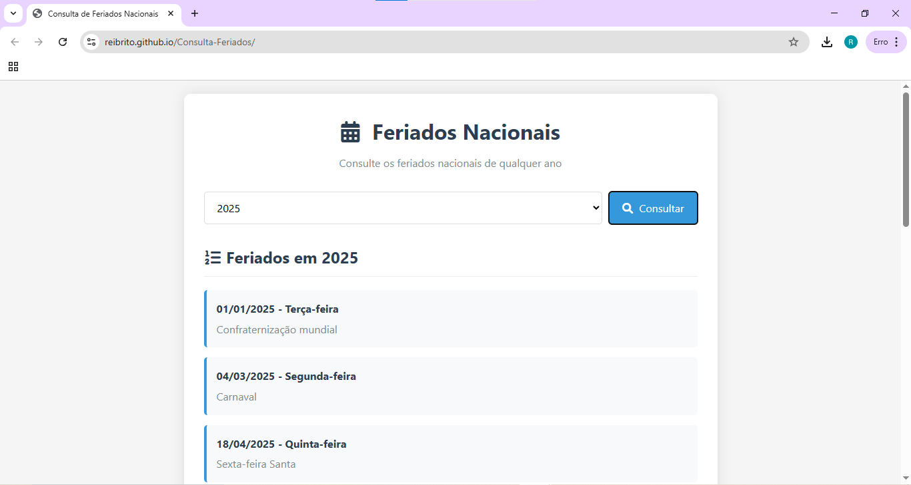

# 📅 Consulta de Feriados Nacionais

Aplicação web moderna e responsiva para consultar os **feriados nacionais brasileiros** de qualquer ano, utilizando a [BrasilAPI](https://brasilapi.com.br).  
Com apenas alguns cliques, o usuário escolhe o ano desejado e recebe a lista completa de feriados com **data, dia da semana e descrição**.

---

## ✨ Funcionalidades

- 🔍 Seleção de qualquer ano entre **2000** até **(ano atual + 2)**  
- 📆 Exibição detalhada dos feriados nacionais:  
  - Data  
  - Dia da semana  
  - Nome do feriado  
- ⚡ Consulta em tempo real via **BrasilAPI**  
- 🎨 Interface responsiva, leve e elegante  
- ❌ Tratamento de erros e mensagens de feedback  
- 📱 Compatível com dispositivos móveis  

---

## 🚀 Tecnologias Utilizadas

- **HTML5** → Estrutura semântica  
- **CSS3** → Estilização moderna e responsiva  
- **JavaScript (ES6)** → Lógica e integração com API  
- **[BrasilAPI](https://brasilapi.com.br/docs#tag/Feriados)** → Fonte oficial dos feriados  
- **Font Awesome** → Ícones para melhor usabilidade  

---

## 📂 Estrutura do Projeto

```
├── index.html # Estrutura principal da aplicação
├── style.css # Estilos e responsividade
└── script.js # Lógica de consulta e exibição dos feriados
```
---

## ⚡ Como Usar Localmente


1. Clone este repositório:
   ```bash
   git clone https://github.com/ReiBrito/Consulta-Feriados.git
   ```
Acesse a pasta do projeto:

```bash
Copiar
Editar
cd Consulta-Feriados
```
Abra o arquivo index.html no navegador:

```bash
Copiar
Editar
start index.html   # Windows
open index.html    # Mac
xdg-open index.html # Linux
```
Selecione o ano e clique em Consultar para visualizar os feriados.

🌐 Demonstração

link do GitHub Pages para testar:

👉 https://ReiBrito.github.io/Consulta-Feriados/

🖼️ Imagens



📌 Melhorias Futuras

📊 Opção de exportar feriados em PDF/Excel

🌍 Consulta de feriados estaduais e municipais

📅 Integração com Google Calendar ou Outlook

🔔 Lembretes automáticos para próximos feriados

👨‍💻 Autor
Desenvolvido por Reinaldo Brito 💙

Sinta-se livre para contribuir, sugerir melhorias ou adaptar ao seu uso!
